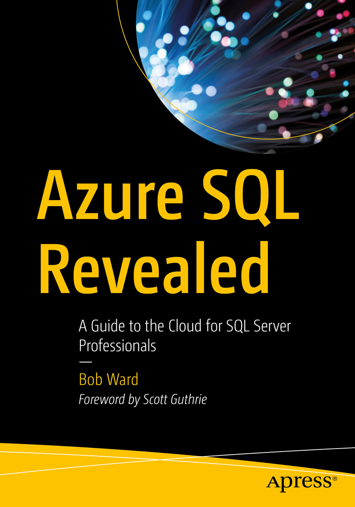

# Azure SQL Revealed

<h2><b>     About this Book</b></h2>

Access detailed content and examples on Azure SQL, a set of cloud services that allows for SQL Server to be deployed in the cloud. This book teaches the fundamentals of deployment, configuration, security, performance, and availability of Azure SQL from the perspective of these same tasks and capabilities in SQL Server. This distinct approach makes this book an ideal learning platform for readers familiar with SQL Server on-premises who want to migrate their skills toward providing cloud solutions to an enterprise market that is increasingly cloud-focused.

If you know SQL Server, you will love this book. You will be able to take your existing knowledge of SQL Server and translate that knowledge into the world of cloud services from the Microsoft Azure platform, and in particular into Azure SQL. This book provides information never seen before about the history and architecture of Azure SQL. Author Bob Ward is a leading expert with access to and support from the Microsoft engineering team that built Azure SQL and related database cloud services. He presents powerful, behind-the-scenes insights into the workings of one of the most popular database cloud services in the industry.

## What You Will Learn

Know the history of Azure SQL
Deploy, configure, and connect to Azure SQL
Choose the correct way to deploy SQL Server in Azure
Migrate existing SQL Server instances to Azure SQL
Monitor and tune Azure SQL’s performance to meet your needs
Ensure your data and application are highly available
Secure your data from attack and theft

## Who This Book Is For

This book is designed to teach SQL Server in the Azure cloud to the SQL Server professional. Anyone who operates, manages, or develops applications for SQL Server will benefit from this book. Readers will be able to translate their current knowledge of SQL Server—especially of SQL Server 2019—directly to Azure. This book is ideal for database professionals looking to remain relevant as their customer base moves into the cloud.   

<h2><b>     Using the Examples</b></h2>

The examples for this book are available through scripts in folders on this GitHub repo. They are provided as a reference for you to use as a compliment while reading the book. You need to read the chapters of the book to see instructions, with example output, on how to use these examples. In some cases, example commands are provide *inline* in the book itself. Many chapters have examples based on step-by-step usage of the Azure Portal and therefore there are not as many script examples. You will need an Azure subscription for all of the examples. 

<h2><b>     Additional Information for the Book</b></h2>

This section is reserved for any updates or corrections as found by the community, myself, or Azure SQL experts.