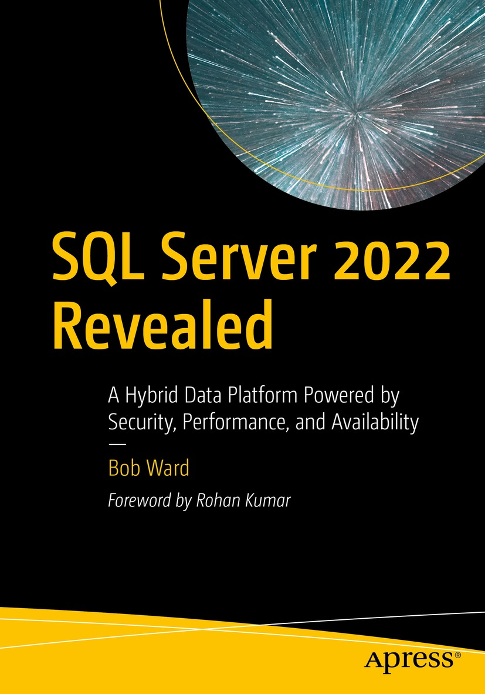

# SQL Server 2022 Revealed

<h2><b>     About this Book</b></h2>

Know how to use the new capabilities and cloud integrations in SQL Server 2022. This book covers the many innovative integrations with the Azure Cloud that make SQL Server 2022 the most cloud-connected edition ever. The book covers cutting-edge features such as the blockchain-based Ledger for creating a tamper-evident record of changes to data over time that you can rely on to be correct and reliable. You’ll learn about built-in Query Intelligence capabilities to help you to upgrade with confidence

that your applications will perform at least as fast af ter the upgrade than before. In fact, you’ll probably see an increase in performance from the upgrade, with no code changes needed. Also covered are innovations such as contained availability groups
and data virtualization with S3 object storage. New cloud integrations covered in this book include Microsof t Azure Purview and the
use of Azure SQL for high availability and disaster recovery. The book covers Azure Synapse Link with its built-in capabilities to take changes and put them into Synapse automatically. Anyone building their career around SQL Server will want this book for the valuable information it provides on building SQL skills from edge to the cloud.

### What You Will Learn

- Learn all the new capabilities and cloud integrations in SQL Server 2022
- Connect to Azure for disaster recovery, near real-time analytics, and security
- Leverage the Ledger to create a tamper-evident record of data changes over time
- Upgrade and achieve faster and more consistent performance with no code changes
- Make use of Parquet and S3 without moving data and using your existing T-SQL skills
- Explore new innovations with T-SQL in areas such as JSON and time series

<h2><b>     Using the Examples</b></h2>

The examples for this book are available through scripts in folders on this GitHub repo. They are provided as a reference for you to use as a compliment while reading the book. You need to read the chapters of the book to see instructions, with example output, on how to use these examples. In some cases, example commands are provide *inline* in the book itself.

It is possible to use many the examples in this book on a SQL Server 2022 deployment on a laptop. Chapter 3 also requires you to have an Azure subscription to connect SQL Server Azure.

<h2><b>     Additional Information for the Book</b></h2>

 