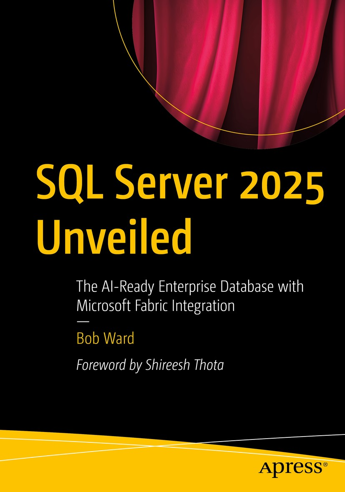

# SQL Server 2025 Revealed

This document is intended to provide "extra" information and any errata about *SQL Server 2025 Unveiled*. In addition, example scripts from the book are provided in folders by chapter number.

## About this book

Welcome to SQL Server 2025 Unveiled. This book is designed to introduce you to the new features and capabilities of SQL Server 2025. Whether you are a database administrator, developer, or data professional, this book will provide you with the knowledge and skills needed to leverage the latest advancements in SQL Server technology.

## Using the examples

The example scripts for this book are available through scripts in folders per chapter number. They are provided as a reference for you to use as a complement while reading the book. You need to read the chapters of the book to see instructions, with example output, on how to use these examples. In some cases, example commands are provide *inline* in the book itself.

Since I turned in my final manuscript I also have built a repository of examples that you can use to see the features in action. You can find these at https://aka.ms/sqlserver2025demos.

## Additional information since the release of the book

This book was authored during the preview period of SQL Server 2025. Therefore, some details about SQL Server 2025 that are announced at General Availability may not have made it into the book. This section is intended to supplement those details. In addition, any errata found after the book was published will be listed here. If you find any errors in the book, please report them as issues as part of this GitHub repository at https://github.com/microsoft/bobsql/issues. Please include the chapter and page number, along with a description of the error.

You can also see the story of SQL Server 2025 from the Microsoft Ignite session at https://ignite.microsoft.com/en-US/sessions/BRK124.

### Chapter 1

1. In Chapter 1 on page 9 the title of this section should be May 2025 Events and Launch.

2. Some of the decks mentioned in this chapter at https://aka.ms/sqlserver2025 decks can be found in the Preview folder.

3. On page 17 of the book I mention benchmarks. We announced new benchmarks at GA which you can find at https://www.tpc.org/3408, https://www.tpc.org/3409 and https://www.tpc.org/3410.

4. SSMS 22 came out after I turned in my final manuscript. Check out the latest at https://aka.ms/ssms.

5. https://aka.ms/getsqlserver2025 points to a site to download SQL Server 2025 after filling out a form. https://aka.ms/getsqlserver points directly to the download center.

6. On page 26 I mentioned SQL Server 2025 editions which I could not give details out when I turned in the manuscript as the book was available before GA. The changes to our editions are one of the "hero" stories of the release. These changes include:

    - SQL Server Express gets a bump up for max database size to 50GB.
    - SQL Server Standard Edition increases cores to 32 and memory to 256GB. In addition, resource governor is now available in Standard Edition.

    Read all the details at https://aka.ms/sqlserver2025editions.

### Chapter 3

1. On page 46 I mention Azure AI Foundry. Microsoft has renamed this to Microsoft Foundry. Read the details at https://azure.microsoft.com/products/ai-foundry.

### Chapter 4

1. On page 74 I mention the new vector data type. By GA we also introduced a new half-precision floating point option for a vector data type. This allows you to go past the existing 1998 dimension limit. Read more at https://learn.microsoft.com/sql/t-sql/data-types/vector-data-type-half-precision-float. 

2.  On page 89 I have a complete end-to-end example for using vector searching. I have updated examples you can also use at https://aka.ms/sqlserver2025demos under the AI folder. This includes complete examples with all API_TYPE formats.

### Chapter 5

1. On page 112 I have an example using the new JSON index. I found on machines with more processors the example without the JSON index was just as fast as the index. This is because that plan uses DOP. I have an updated example you can see at https://aka.ms/sqlserver2025demos under the json folder.

2. On page 126 I have an example using the new REGEXP_LIKE function. I found out while testing this with SSMS 22 and GitHub Copilot, that my expressions were not totally complete. You can see an updated example at https://aka.ms/sqlserver2025demos under the regex folder.

3. On page 156 I have an example using sp_invoke_external_endpoint to show how to take results of a vector searching and generate interesting results with a local AI chat completion model. I have a new alternate example you can see at https://aka.ms/sqlserver2025demos under the REST folder.

