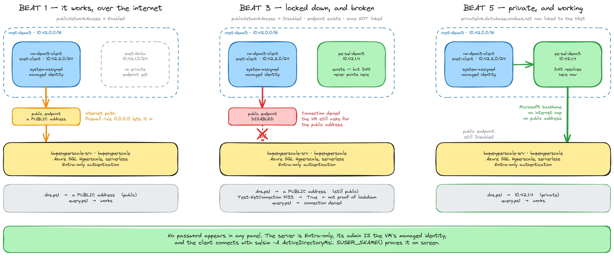

# Demo 3 — The control plane is the security perimeter

DATACON 2026, *Why Azure Is the Best Cloud for SQL*. Section 3.

## What it proves

A network perimeter around a PaaS database is a control-plane property, not a
firewall configuration exercise. Five `az` commands take a database from
publicly addressable to reachable only from inside a VNet — with no firewall
rule deleted, no VPN client, no code change, no redeploy, and no new connection
string.

The demo also lands the single most common Private Link failure in production:
the private endpoint is right, the DNS zone is right, the A record is right,
and it still resolves to a public IP because nobody linked the zone to the VNet.

## The arc — 5 beats, all live

| Beat | Where | Command | Result |
| --- | --- | --- | --- |
| 1 | VM | `.\query.ps1` | Works over the public endpoint |
| 2 | Laptop | `.\beat-2-add-privatelink.ps1` | Private endpoint + DNS zone + A record. **No VNet link** |
| 2 | VM | `.\query.ps1` | **Still works.** Adding Private Link broke nothing |
| 3 | Laptop | `.\beat-3-lockdown.ps1` | `publicNetworkAccess=Disabled` |
| 4 | VM | `.\query.ps1 -Expect Fail` | **Blocked** — public access denied |
| 4 | VM | `.\dns.ps1` | Resolves a **public** IP — the zone isn't linked |
| 5 | Laptop | `.\beat-5-dns-link.ps1` | VNet link created |
| 5 | VM | `.\dns.ps1` | Resolves **10.42.1.4** |
| 5 | VM | `.\query.ps1` | Works again, privately |

Two windows on screen the whole time: the laptop terminal is the control plane,
the RDP session is the client. They never swap. That split *is* the point.

**Rehearsed end to end 2026-08-23** in `centralus`. Every beat produced its
intended result, and `reset-demo.ps1` → `05-verify.ps1` returned 17/17 PASS
afterwards.

## The slide



Source is `private-link-progression.excalidraw`. Re-export after any edit:

```powershell
cd c:\bwsql\tools\excalidraw
node render.mjs "c:\bwsql\presentations\dataconus2026\whyazurebest\demos\demo3_controlplane\private-link-progression.excalidraw" --scale 3
```

The private address and the topology on the slide are real. Public-side
addresses are deliberately *not* pinned — the gateway address varies by region
and round-robins between rehearsals.

## What Beat 4 actually puts on screen

`dns.ps1` prints the whole CNAME chain, and it is a better slide than the
summary suggests:

```
bwpehyperscale-srv.database.windows.net
  → bwpehyperscale-srv.privatelink.database.windows.net   ← Azure already redirects here
      → <dataslice>.<region>.database.windows.net
          → <dataslice><region>.trafficmanager.net
              → <gateway>.control.database.windows.net → a PUBLIC address
```

The tail of that chain is region-specific and the final address round-robins,
so read it off the screen rather than quoting a number.

The moment a private endpoint exists, **public DNS already hands back the
`privatelink` name**. The VM is asking for exactly the right thing. It just has
no private zone to answer with, so resolution falls through the public chain.
That is Learn's number-one Private Link failure cause, live:

> The private DNS zone isn't linked to the querying VNet (the most common reason).

Say this out loud at Beat 4 — `Test-NetConnection ... -Port 1433` reports
**`TcpTestSucceeded : True` even with public access disabled**. The TCP
handshake to the gateway still completes; the rejection happens at *login*.
Nobody should use `Test-NetConnection` as proof that a database is
locked down.

## Rehearsing it again (the short version)

Everything is already built. To run the arc start to finish:

```powershell
# Laptop, in this folder
.\reset-demo.ps1        # rewinds beats 2, 3, 5; repoints RDP at your current IP
.\05-verify.ps1         # must print 17/17 PASS, "Demo is in its Beat 1 state"
mstsc .\demo3.rdp       # sign in as demoadmin
```

Then alternate windows:

| # | Window | Run |
| --- | --- | --- |
| 1 | VM | `.\query.ps1` |
| 2 | Laptop | `.\beat-2-add-privatelink.ps1` |
| 2 | VM | `.\query.ps1` |
| 3 | Laptop | `.\beat-3-lockdown.ps1` |
| 4 | VM | `.\query.ps1 -Expect Fail` then `.\dns.ps1` |
| 5 | Laptop | `.\beat-5-dns-link.ps1` |
| 5 | VM | `.\dns.ps1` then `.\query.ps1` |

If `dns.ps1` still shows the public IP right after Beat 5, run it once more —
the link takes a few seconds to propagate. `Clear-DnsClientCache` is already in
the script.

## First-time setup on a new machine — the two phases

Skip this if the environment already exists; use the rehearsal card above.

**Phase 1 — laptop, `az` CLI only.** Zero SQL connections.

```powershell
.\setup-all.ps1
```

Steps 1–5 create the network, the VM, the Entra-only server, the Hyperscale
database, and the ODBC client prerequisites. Step 2 prompts for the VM local
administrator password. It then **pauses** and tells you exactly what to copy.
Nothing is installed on your laptop. `04-vm-prereqs.ps1` runs every command
*inside the VM* through `az vm run-command invoke`.

The database is created **empty**. The demo proves reachability and identity,
not data, so every beat runs:

```sql
SELECT DB_NAME() AS [Database], SUSER_SNAME() AS [ConnectedAs], CURRENT_TIMESTAMP AS [At]
```

`SUSER_SNAME()` prints the managed identity by name, so the audience sees the
passwordless connection on screen rather than being told about it.

**Phase 2 — getting the demo kit onto the VM.**

Three of the four files push themselves from the laptop over
`az vm run-command`, no RDP required:

```powershell
.\push-vmkit.ps1     # writes config.ps1, query.ps1, dns.ps1 into C:\demo
```

**Re-run `push-vmkit.ps1` after editing anything under `vmkit/`.** The VM keeps
its own copy in `C:\demo`; editing the file here changes nothing on the VM until
you push again. The push is idempotent, so when in doubt, push.

Only `sqlsim.exe` needs a hand — it's too large to push through `run-command`
reliably:

| From | To |
| --- | --- |
| `C:\bwsql\sqlsimtools\sqlsim\build\x64\Release\sqlsim.exe` | `C:\demo\sqlsim.exe` |

`demo3.rdp` turns on local drive redirection, so your laptop's drives appear
under **This PC** in the session and you can drag it across. `C:\demo` should
end up holding exactly `sqlsim.exe`, `config.ps1`, `query.ps1`, `dns.ps1`. Then:

```powershell
.\setup-all.ps1 -From 6
```

## Why there are no credentials anywhere

The logical server is created with `--enable-ad-only-auth`, so SQL
authentication is off from birth. Microsoft Learn:

> The server SQL administrator will be automatically created and the password
> will be set to a random password. Since SQL authentication connectivity is
> disabled with this server creation, the SQL administrator login won't be used.

The Microsoft Entra admin is **the VM's system-assigned managed identity**.
Learn permits a user, a group, or an application as the admin, and for a service
principal you supply the Application ID. So inside the VM:

```powershell
sqlsim -S bwpehyperscale-srv.database.windows.net -d bwpehyperscale -A ActiveDirectoryMsi -Q "..."
```

connects as a **full admin** with no token, no `CREATE USER`, and nothing that
expires. That is why there is no "grant the VM access" step and why you never
have to sign in to Entra inside the VM.

The trade-off, accepted deliberately: you cannot connect to this database from
your laptop at all. Setup is `az`-only by design, and the admin is reassignable
from the control plane in one command if you ever need to.

## The 0.0.0.0 rule is deliberately ON at Beat 1

`AllowAllWindowsAzureIps` is what the portal checkbox *"Allow Azure services and
resources to access this server"* creates. Learn:

> your server allows communications from all resources inside the Azure
> boundary, regardless of whether they are part of your subscription.

It is the anti-pattern this demo exists to kill. Beat 3 prints the firewall
rules, leaves every one of them in place, and disables public access anyway —
so the audience sees that the rule bought nothing and cost nothing to keep.

Do not "tidy it up" between rehearsals. `reset-demo.ps1` recreates it if it goes
missing.

## Region and names live in `00-config.ps1` — and in one other place

Every laptop-side script dot-sources `00-config.ps1`, so the subscription,
resource group, `$Location`, `$ServerName`, and `$DatabaseName` are set once and
inherited everywhere. Moving the demo to another region is an edit to that file
plus a teardown and a rebuild.

**The exception, and it is a real trap:** `vmkit/config.ps1` runs *inside the VM*,
where `00-config.ps1` does not exist. `push-vmkit.ps1` copies it **verbatim** — it
is not generated. So the server FQDN and database name are written down twice,
and nothing enforces that they agree.

If you rename or move the server, change both files. Symptom of getting it wrong:
every laptop script and `05-verify.ps1` pass cleanly while `query.ps1` on the VM
fails against a server that no longer exists.

```powershell
# After any rename, confirm the VM actually holds the new values:
. .\00-config.ps1
Invoke-VmScript "Get-Content 'C:\demo\config.ps1' | Select-String 'ServerFqdn|DatabaseName'"
```

## Ordering that is load-bearing

- **Beat 2 does not create the VNet link.** If the link exists, Beat 4 shows a
  private IP and the whole payoff evaporates. `05-verify.ps1` fails if it finds
  one.
- **`reset-demo.ps1` re-enables public access first.** Learn: *"When Public
  network access is set to Disable, any attempts to add, remove, or edit any
  firewall rules will be denied"* — Error 42101.
- **The VM is created before the logical server**, because its managed identity
  has to exist before it can be named as the Entra admin.

## Between rehearsals

```powershell
.\reset-demo.ps1     # rewinds beats 2, 3, 5; repoints RDP at your current IP
.\05-verify.ps1      # exits 1 if anything is out of place
```

Run both on the morning of the talk. A different venue means a different egress
IP, which breaks RDP until `allow-me.ps1` runs — `reset-demo.ps1` calls it for
you, or run it standalone:

```powershell
.\allow-me.ps1
```

## How the VM gets in and out

- **Inbound:** the subnet NSG denies the internet at priority 4000. One
  exception, priority 100: TCP 3389 from your current public IP `/32`. There is
  no NIC-level NSG — `02-vm.ps1` asserts that, so there's only ever one place to
  look.
- **Outbound:** a Standard public IP. That's how the VM reaches the public SQL
  endpoint in Beat 1 and ARM throughout.
- **Management:** `az vm run-command invoke` goes through ARM, not the VNet, so
  `04-vm-prereqs.ps1` and `05-verify.ps1` keep working from conference wifi even
  after public network access is disabled. It's also your way back in if RDP
  breaks.

## The client is sqlsim, not sqlcmd

`sqlcmd -G` cannot use a system-assigned managed identity — Learn: *"doesn't
work with system identities, and requires a user principal login."* `sqlsim`
supports `-A ActiveDirectoryMsi`. Its only hard dependency is ODBC Driver 18,
which `04-vm-prereqs.ps1` installs.

## If someone asks "but I can still resolve the name"

Yes. The DNS name stays public and the resource stays enumerable. Learn's
framing is the answer: **resource existence is enumerable; resource access is
not.** Beat 4 is the proof — the name resolves fine and the connection is
refused.

## Settled by rehearsal — do not relitigate

| Question | Answer, measured |
| --- | --- |
| `--external-admin-sid` with a managed identity: appId or objectId? | **Application (client) ID.** Azure SQL matches the token's `appid` claim. `03-sql.ps1` uses it and deliberately has **no** objectId fallback — the object ID yields a server that authenticates but fails login |
| Does the `0.0.0.0` rule actually admit this VM? | **Yes.** Beat 1 connects over the public endpoint from the VM's Standard public IP |
| Does VC++ matter before ODBC? | **Yes.** The ODBC 18 MSI returns 1603 and logs `Error 1723 ... install the Visual C++ Redistributable`. `04-vm-prereqs.ps1` installs VC++ first |

## A trap worth knowing if you edit these scripts

`az network private-endpoint dns-zone-group show` returns **exit 0 and `{}`**
when the group does not exist. `ConvertFrom-Json '{}'` yields a truthy
`PSCustomObject`, so a naive `if ($x) { skip }` reports *"Already exists"* and
skips the create — silently. That happened during rehearsal: Beat 2 claimed
success while creating nothing, and the only tell was an empty A-record list.
Left unfixed, Beat 5 would have linked the VNet to an empty zone and DNS would
still have returned the public IP — dead at the punchline.

`Invoke-Az` in `00-config.ps1` now maps a property-less object to `$null`, which
fixes the whole class in one place. **Verify an existence check by its side
effect** (was the A record written?), never by the message it prints.

## Why the admin is assigned at server-create time

`az sql server ad-admin create` takes only `--display-name` and `--object-id`.
It has **no `--principal-type` switch**, so it cannot declare an admin as an
`Application` — only `az sql server create --external-admin-principal-type`
can. Assigning the managed identity after the fact would risk it being recorded
as the wrong principal type, which breaks MSI auth silently. So it happens at
create time, in one command, and fails immediately if it's going to fail.

## Files

Everything in the folder root runs on the **laptop** and speaks only `az`.
Everything in `vmkit/` runs **inside the VM** and speaks only `sqlsim`.

| File | Purpose |
| --- | --- |
| `00-config.ps1` | Every name, address and helper. Dot-sourced by all the rest |
| `setup-all.ps1` | Phase 1 driver, steps 1–6, `-From` / `-To`, idempotent |
| `01-network.ps1` | VNet `10.42.0.0/16`, both subnets, NSG |
| `02-vm.ps1` | Client VM + system-assigned managed identity |
| `03-sql.ps1` | Entra-only logical server + Hyperscale database |
| `04-vm-prereqs.ps1` | VC++ then ODBC 18, inside the VM via `run-command` |
| `05-verify.ps1` | 17-check pre-flight. Exits 1 if the demo isn't at Beat 1 |
| `allow-me.ps1` | Repoints the RDP rule at your current public IP |
| `push-vmkit.ps1` | Copies `vmkit/*.ps1` into `C:\demo` |
| `beat-2-add-privatelink.ps1` | Private endpoint + zone + A record. **No VNet link** |
| `beat-3-lockdown.ps1` | `publicNetworkAccess=Disabled` |
| `beat-5-dns-link.ps1` | Links the private zone to the VNet |
| `reset-demo.ps1` | Rewinds beats 2, 3 and 5 back to Beat 1 |
| `99-teardown.ps1` | Deletes everything except the resource group |
| `demo3.rdp` | Written by `allow-me.ps1`; drive redirection on |
| `private-link-progression.excalidraw` / `.png` | The slide |
| `vmkit/config.ps1` | **VM-side** names. Must match `00-config.ps1` |
| `vmkit/query.ps1` | The demo query. `-Expect Fail` for Beat 4 |
| `vmkit/dns.ps1` | Prints the CNAME chain and the resolved address |

## Cost

One `Standard_E2s_v5` VM and one serverless Hyperscale database (`HS_S_Gen5_2`).
Serverless Hyperscale autoscales compute and bills per second — it does **not**
auto-pause; that's General Purpose only. Deallocate the VM between rehearsals.

## Teardown

```powershell
.\99-teardown.ps1 -Confirm
```

Deletes the VM, private endpoint, DNS zone, logical server, database, VNet, and
NSG. **Leaves `bwsqlestaterg` in place** — demo 1 counts resources in it.
Teardown drops demo 1's estate by one logical server and one database.
